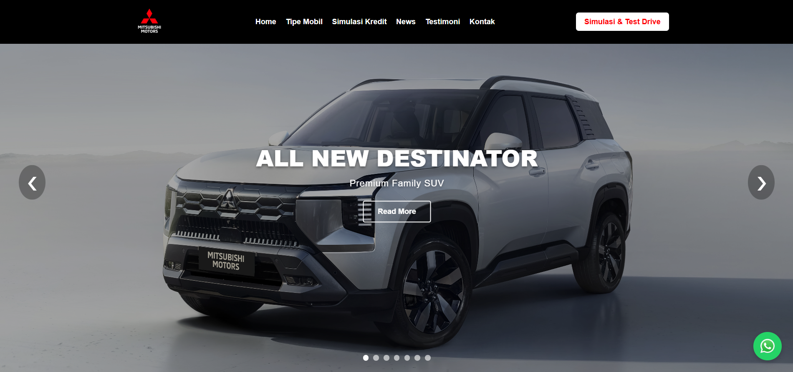
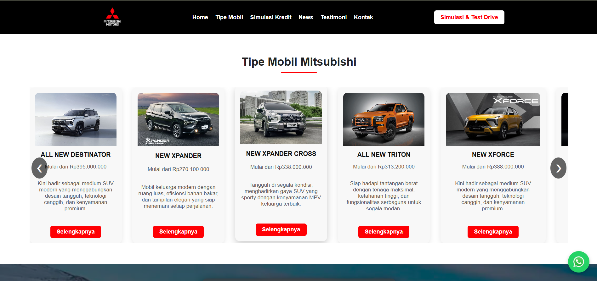
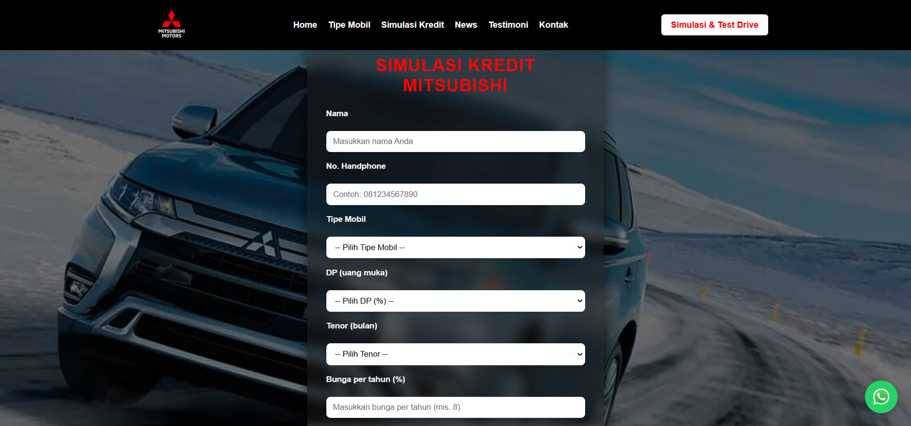

# Mitsubishi Website

Website company profile dan katalog mobil Mitsubishi yang menampilkan informasi produk, spesifikasi, serta halaman detail setiap kendaraan.

## Fitur

- Landing Page Responsif
- Daftar Mobil Mitsubishi
- Halaman Detail Kendaraan
- Informasi Promo & Dealer
- Responsive Design
- Navigasi yang mudah digunakan
- Informasi Kontak Sales
- Tombol WhatsApp

## Teknologi


## Struktur Folder

```
Mitsubishi/
│── asset/
│── mitsubishi/
│── index.html
│── style.css
│── script.js
│── deskripsi-xforce.html
│── deskripsi-xpander.html
│── deskripsi-triton.html
│── ...
```

## Cara Menjalankan

1. Clone repository

```bash
git clone https://github.com/Mhmdpii/Mitsubishi.git
```

2. Buka folder project

```bash
cd Mitsubishi
```

3. Jalankan file `index.html` menggunakan browser.

## Screenshot

Tambahkan beberapa screenshot seperti:

- Halaman Home
  
  
  
- Halaman Detail Mobil
  
  
  
- Halaman Simulasi Kredit
  
  

## Author

Muhammad Rafli
